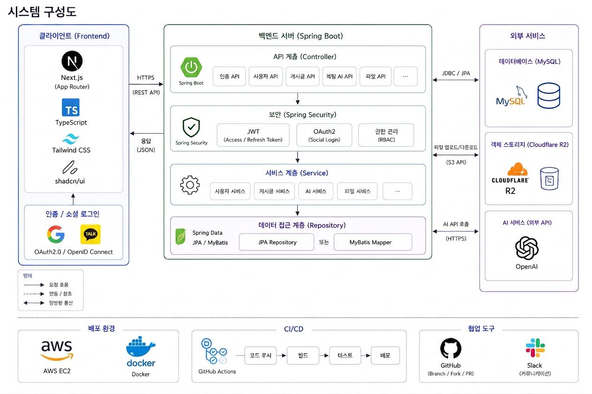
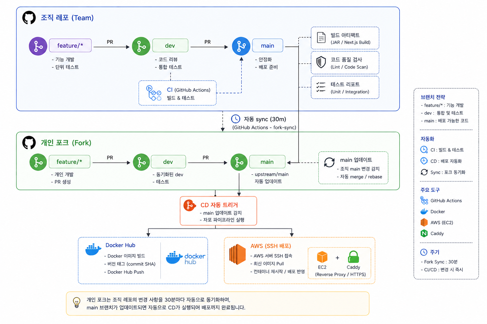
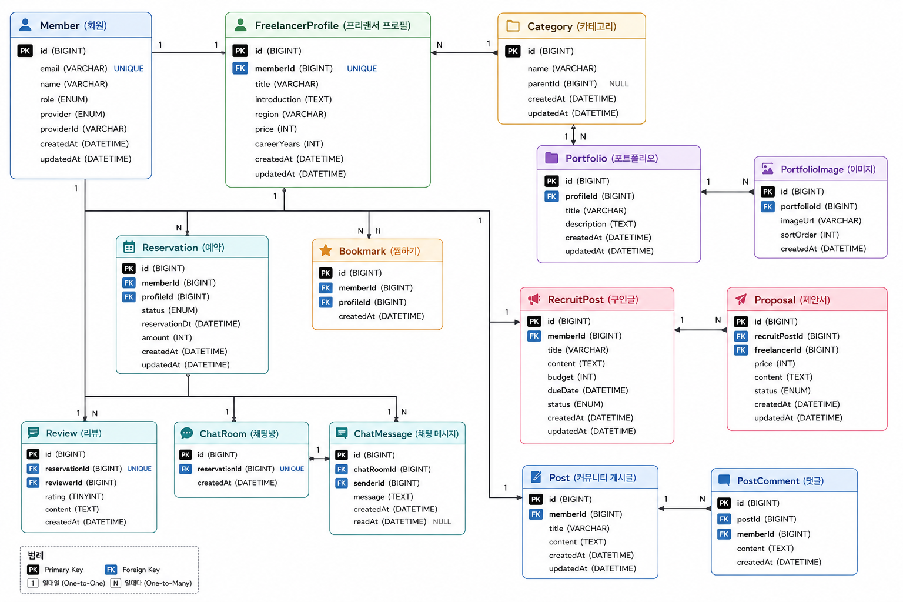
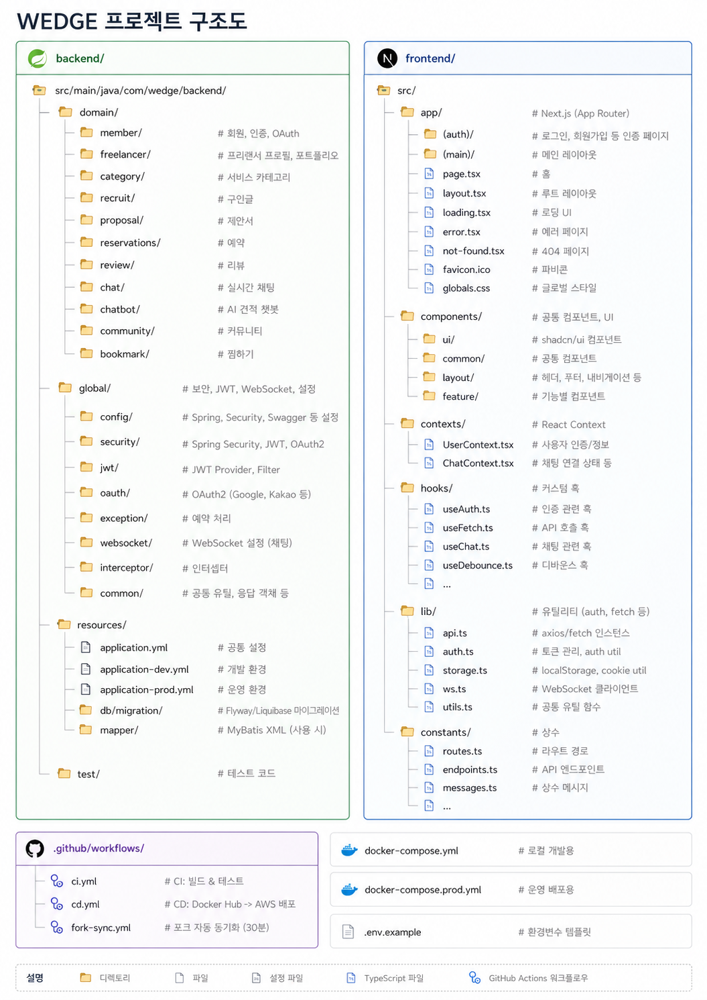

# 💍 Wedge - 웨딩 프리랜서 매칭 플랫폼

예비부부와 웨딩 프리랜서를 연결하는 매칭 플랫폼입니다.  
전문가 탐색부터 견적 문의, 예약, 리뷰까지 웨딩 준비의 전 과정을 하나의 서비스에서 제공합니다.

> **프로젝트 기간** : 2026.06.11 ~ 2026.06.24  
> **배포 URL** : [wedge-tawny.vercel.app](https://wedge-tawny.vercel.app)  
> **API 문서** : [api.wedge.o-r.kr/swagger-ui.html](https://api.wedge.o-r.kr/swagger-ui.html)


---

## 목차

- [주요 기능](#주요-기능)
- [기술 스택](#기술-스택)
- [시스템 아키텍처](#시스템-아키텍처)
- [CI/CD 파이프라인](#cicd-파이프라인)
- [ERD](#erd)
- [프로젝트 구조](#프로젝트-구조)
- [로컬 실행 방법](#로컬-실행-방법)
- [팀원 소개 및 담당](#팀원-소개-및-담당)

---

## ✨ 주요 기능

### 사용자
| 기능 | 설명 |
|------|------|
| **회원가입/로그인** | 이메일 인증(코드 발송) + 카카오/구글 소셜 로그인 |
| **비밀번호 찾기** | 임시 비밀번호 이메일 발송 |
| **역할 기반 접근** | 예비부부(CLIENT)와 프리랜서(FREELANCER) 역할 분리 |
| **JWT 인증** | Access Token + Refresh Token(RTR) 기반 인증, 자동 갱신 |

### 전문가 탐색 & 매칭
| 기능 | 설명 |
|------|------|
| **전문가 검색** | 카테고리, 지역, 키워드 필터링 및 정렬 |
| **포트폴리오** | 프리랜서 작업물 갤러리 (다중 이미지) |
| **찜하기** | 관심 프리랜서 북마크 |
| **AI 추천** | OpenAI 기반 프리랜서 매칭 추천 |

### 예약 & 리뷰
| 기능 | 설명 |
|------|------|
| **예약 관리** | 요청 - 수락 - 완료 워크플로우 |
| **실시간 채팅** | WebSocket(STOMP) 기반 1:1 메시지, 읽음 확인 |
| **리뷰 시스템** | 별점(5점) + 텍스트 리뷰 |

### AI 기능
| 기능 | 설명 |
|------|------|
| **AI 견적 챗봇** | 3단계 대화를 통한 웨딩 예산 추정 (GPT-4o-mini) |
| **자기소개 생성** | 키워드 기반 프리랜서 소개글 자동 작성 |

### 구인 & 제안 상세
| 기능 | 설명 |
|------|------|
| **구인글 작성** | 카테고리, 예산, 웨딩 예정일, 지역, 이미지 첨부 |
| **구인글 필터링** | 카테고리, 지역, 모집 상태(모집중/마감)별 필터 |
| **지원자 수 표시** | 구인글 카드에 제안서 수 실시간 표시 |
| **제안서 작성** | 프리랜서가 가격, 지역, 상세 내용으로 제안 |
| **제안서 관리** | 수락/거절/수락 취소 처리, 내가 보낸 제안 목록 조회 |
| **모집 상태 관리** | OPEN/CLOSED 상태 전환, 마감 시 수정 차단 |

### 커뮤니티
| 기능 | 설명 |
|------|------|
| **게시글 작성** | 이미지 첨부, 카테고리(웨딩 후기/꿀팁/게시판) 선택 |
| **게시글 목록** | 카테고리별 탭 필터링, 페이지네이션 |
| **게시글 수정/삭제** | 본인 게시글 관리 |
| **내 게시글** | 마이페이지에서 작성글 모아보기 |

### 프리랜서 프로필 & 포트폴리오
| 기능 | 설명 |
|------|------|
| **프로필 등록/수정/조회** | 카테고리·소개글·지역·가격 설정, 본인 검증 |
| **포트폴리오 이미지 업로드** | Cloudflare R2, 다중 이미지, 10MB 제한 |
| **열람 권한 처리** | 비로그인 시 3장 제한 (서버 응답 + 프론트 UI) |
| **리뷰 탭 UI** | 평균 별점·리뷰 수 표시, 프론트 페이지네이션 |

### 마이페이지
| 기능 | 설명 |
|------|------|
| **마이페이지 UX 개편** | URL 쿼리 파라미터 기반 탭 전환, 새로고침 상태 유지 |
| **역할별 색상 테마** | CLIENT(핑크) / FREELANCER(그린) 공통화 |
| **프로필 이미지 업로드/삭제** | R2 연동, 저장 버튼 클릭 시 반영 |
| **전역 유저 상태 관리** | UserContext, API 중복 호출 제거 |

---

## 🛠 기술 스택

### Backend

| 분류 | 기술 |
|------|------|
| Framework | Spring Boot 4.0.6 (Java 21) |
| Database | MySQL 8.0 |
| Cache | Redis |
| Auth | JWT + OAuth2 (Kakao, Google) |
| Real-time | WebSocket / STOMP |
| AI | Spring AI + OpenAI (GPT-4o-mini) |
| Storage | Cloudflare R2 (S3 호환) |
| Mail | Gmail SMTP (이메일 인증) |
| API Docs | SpringDoc OpenAPI (Swagger) |

### Frontend

| 분류 | 기술 |
|------|------|
| Framework | Next.js 16 (App Router) |
| Language | TypeScript 5 |
| Styling | Tailwind CSS 4 + shadcn/ui |
| State | React Query + Context API |
| Real-time | @stomp/stompjs |

### Infra & DevOps

| 분류 | 기술 |
|------|------|
| Frontend 배포 | Vercel |
| Backend 배포 | AWS EC2 (Docker) |
| HTTPS | Caddy (자동 SSL) |
| CI | GitHub Actions (빌드 & 테스트) |
| CD | GitHub Actions - Docker Hub - AWS SSH 배포 |
| Container | Docker + Docker Compose |

---

## 🏗 시스템 아키텍처



---

## 🔄 CI/CD 파이프라인



---

## 📊 ERD



---

## 📁 프로젝트 구조



---

## 🚀 로컬 실행 방법

### 사전 요구사항
- Java 21, Node.js 18+, Docker

### Backend

```bash
cd backend
cp ../.env.example ../.env   # 환경변수 설정

# Docker로 실행 (MySQL + Redis + Backend)
docker compose up -d

# 또는 직접 실행
./gradlew bootRun
```

### Frontend

```bash
cd frontend
echo "NEXT_PUBLIC_API_URL=http://localhost:8080" > .env
npm install
npm run dev    # http://localhost:3000
```

### 환경변수

| 변수 | 설명 |
|------|------|
| `DB_USERNAME` / `DB_PASSWORD` | MySQL 인증 정보 |
| `JWT_SECRET` | JWT 서명 키 |
| `KAKAO_CLIENT_ID` / `SECRET` | 카카오 OAuth |
| `GOOGLE_CLIENT_ID` / `SECRET` | 구글 OAuth |
| `OPENAI_API_KEY` | OpenAI API 키 |
| `R2_ENDPOINT` / `BUCKET` / `ACCESS_KEY` / `SECRET_KEY` | Cloudflare R2 스토리지 |
| `MAIL_USERNAME` / `MAIL_PASSWORD` | Gmail SMTP (이메일 인증) |
| `FRONTEND_URL` | 프론트엔드 URL (CORS) |

---

## 👥 팀원 소개 및 담당

<table>
  <thead>
    <tr>
      <th width="100">이름</th>
      <th width="200">GitHub</th>
      <th>담당</th>
    </tr>
  </thead>
  <tbody>
    <tr>
      <td><nobr>윤하빈</nobr></td>
      <td><a href="https://github.com/yunabin"></a>&nbsp;<a href="https://github.com/yunabin">@yunabin</a></td>
      <td>찜(북마크) 시스템, 전문가 탐색 API, 추천 프리랜서 캐러셀(Redis 캐싱), AI 견적 챗봇(Spring AI + ChatGPT), Redis 환경 설정</td>
    </tr>
    <tr>
      <td><nobr>정민혁</nobr></td>
      <td><a href="https://github.com/haxxru"></a>&nbsp;<a href="https://github.com/haxxru">@haxxru</a></td>
      <td>회원 인증(JWT·OAuth2·이메일 인증), 비밀번호 찾기, 구인/제안 시스템 CRUD, 커뮤니티 게시판, CI/CD 파이프라인(GitHub Actions), AWS EC2 배포(Docker + Caddy HTTPS)</td>
    </tr>
    <tr>
      <td><nobr>이창민</nobr></td>
      <td><a href="https://github.com/changmin41"></a>&nbsp;<a href="https://github.com/changmin41">@changmin41</a></td>
      <td><i>담당 파트를 작성해주세요</i></td>
    </tr>
    <tr>
      <td><nobr>이민서</nobr></td>
      <td><a href="https://github.com/p7548296-afk"></a>&nbsp;<a href="https://github.com/p7548296-afk">@p7548296-afk</a></td>
      <td><i>프리랜서 프로필 등록·수정·조회(API + 프론트), 포트폴리오 이미지 업로드(Cloudflare R2), 열람 권한 처리(비로그인 3장 제한), 리뷰·평점 목록 조회, 마이페이지 UX(탭·사이드바·역할별 색상 테마), 전역 유저 상태 관리(UserContext), 디자인 시스템</i></td>
    </tr>
  </tbody>
</table>
